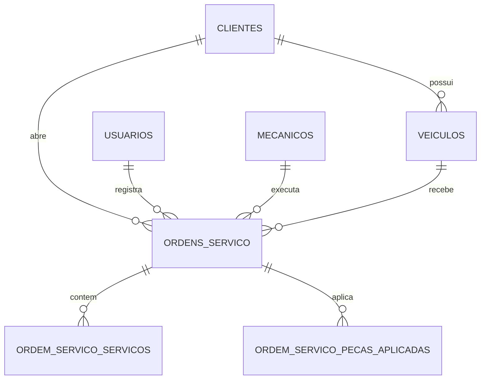

# 🛠️ Oficina Acadêmica - ADS3

Aplicação acadêmica para gestão de oficina mecânica, com foco em **Cliente**, **Usuário**, **Veículo**, **Mecânico** e **Ordem de Serviço**.

> **Escopo desta entrega:** orçamento, catálogo de peças e pagamentos **não são o eixo principal** da solução. Ainda assim, a Ordem de Serviço permite registrar **peças aplicadas** no atendimento.

## 1) Visão geral

Este repositório contém:
- **Frontend Angular** com estrutura inicial de CRUD acadêmico
- **DDL PostgreSQL** em `database/ddl.sql`
- Documentação alinhada ao escopo solicitado

A Ordem de Serviço (OS) contempla:
- serviços executados
- valor de cada serviço
- tempo de execução de cada serviço
- peças aplicadas

## 2) Requisitos funcionais (RF)

- **RF01 - Usuários:** manter usuários para controle de operação e responsável pela OS.
- **RF02 - Clientes:** cadastrar e listar clientes.
- **RF03 - Veículos:** cadastrar veículos vinculados a clientes.
- **RF04 - Mecânicos:** cadastrar e listar mecânicos.
- **RF05 - Ordem de Serviço:** abrir e listar OS, vinculando cliente, veículo, usuário e mecânico.
- **RF06 - Itens de serviço da OS:** registrar descrição, valor e tempo de execução de cada serviço.
- **RF07 - Peças aplicadas na OS:** registrar descrição, quantidade e valor unitário das peças aplicadas.

## 3) Requisitos não funcionais (RNF)

- **RNF01:** modelagem didática e coerente com foco acadêmico.
- **RNF02:** banco de dados PostgreSQL com relacionamentos essenciais do domínio.
- **RNF03:** frontend com navegação simples, rotas claras e componentes standalone.
- **RNF04:** consistência entre documentação, DDL e estrutura do frontend.

## 4) Escopo fora do foco principal

A estrutura de dados pode evoluir futuramente para orçamento e catálogo de peças, porém nesta entrega:
- orçamento e catálogo **não são necessários para operar os fluxos principais**;
- peças continuam sendo registradas diretamente na Ordem de Serviço como itens aplicados.

## 5) Modelagem de domínio

### 5.1 DER (escopo principal)



### 5.2 Entidades centrais

- `usuarios`
- `clientes`
- `veiculos`
- `mecanicos`
- `ordens_servico`
- `ordem_servico_servicos`
- `ordem_servico_pecas_aplicadas`

## 6) DDL PostgreSQL

Arquivo: **`database/ddl.sql`**

Inclui:
- tipos e tabelas principais do domínio
- relacionamentos obrigatórios
- itens de serviços da OS com valor e tempo
- peças aplicadas na OS

### Executar DDL

```bash
psql -U <usuario> -d <banco> -f database/ddl.sql
```

## 7) Frontend Angular

> Foi solicitado Angular 23.x, porém essa versão não está disponível no ambiente da entrega. Foi utilizada a versão estável mais próxima: **Angular 21.2.x**.

### 7.1 Pré-requisitos

- Node.js 20+
- npm 10+

### 7.2 Executar projeto

```bash
npm install
npm start
```

A aplicação sobe em `http://localhost:4200/`.

### 7.3 Build e testes

```bash
npm run build
npm test
```

## 8) Estrutura de pastas

```text
.
├── database/
│   └── ddl.sql
├── src/
│   └── app/
│       ├── modelos/
│       ├── paginas/
│       │   ├── dashboard/
│       │   ├── clientes/
│       │   ├── veiculos/
│       │   ├── mecanicos/
│       │   └── ordens-servico/
│       ├── services/
│       │   └── dados-oficina.service.ts
│       ├── app.routes.ts
│       ├── app.ts
│       └── app.html
└── README.md
```

## 9) Rotas iniciais

- `/dashboard`
- `/clientes`
- `/veiculos`
- `/mecanicos`
- `/ordens-servico`

## 10) Fluxo acadêmico implementado

1. Cadastrar cliente
2. Cadastrar veículo vinculado ao cliente
3. Cadastrar mecânico
4. Abrir OS com vínculos de cliente/veículo/usuário/mecânico
5. Adicionar serviços (descrição, valor, tempo)
6. Adicionar peças aplicadas

Dados estão em serviço **mock/in-memory** (`DadosOficinaService`) para demonstração sem backend real.

## 11) Próximos passos sugeridos

- Persistência real via API REST
- Autenticação/autorização de usuários
- Edição/exclusão completas (CRUD total)
- Cálculo consolidado de totais da OS
- Relatórios acadêmicos por período, cliente e mecânico
