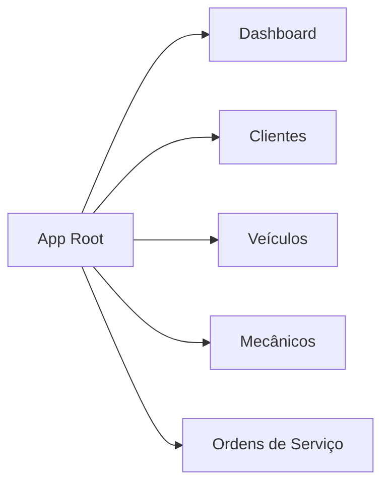
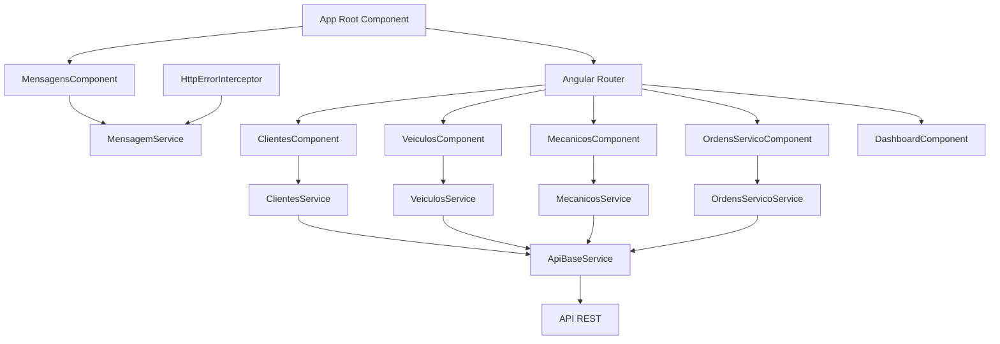
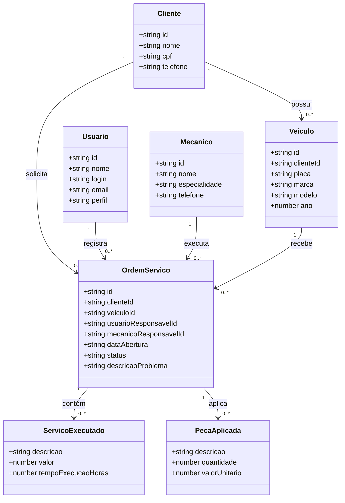
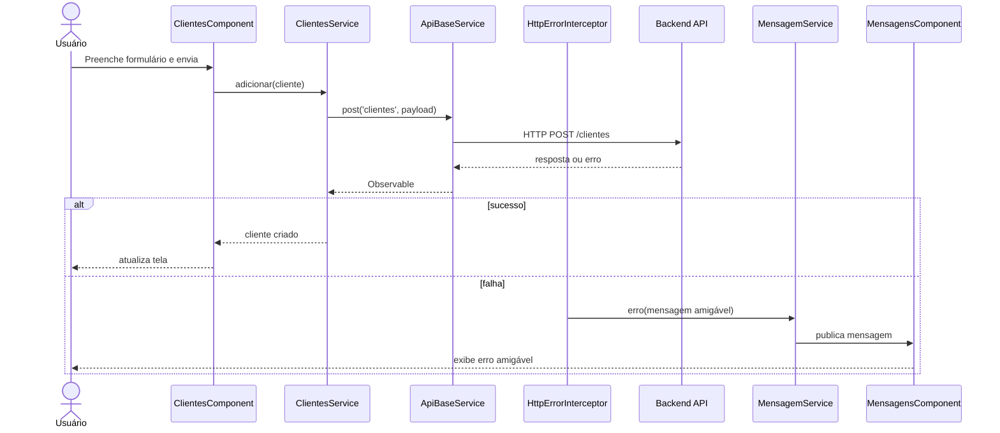
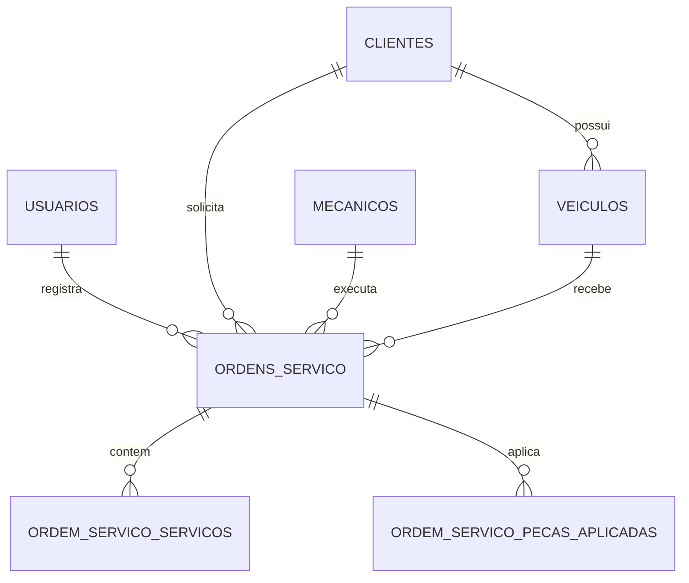

# 🚗 CarRepair

Sistema acadêmico para **gestão de oficina mecânica**, desenvolvido com **Angular 21**, **TypeScript** e modelagem relacional em **PostgreSQL**, com foco em organização didática, separação por domínios e preparação para apresentação técnica em sala de aula.

> **Objetivo desta documentação**: refletir o estado atual do projeto, padronizar a nomenclatura para **CarRepair**, remover a ideia de _mock como fallback operacional_ e consolidar uma visão clara da arquitetura, domínio, banco de dados, fluxos, extensibilidade e operação do sistema.

---

## 1. Visão executiva

O **CarRepair** é uma aplicação de apoio à operação de uma oficina mecânica. O sistema organiza o cadastro e a consulta dos principais elementos do domínio:

- **Usuários** que operam o sistema
- **Clientes** atendidos pela oficina
- **Veículos** vinculados aos clientes
- **Mecânicos** responsáveis pela execução técnica
- **Ordens de Serviço (OS)** que centralizam atendimento, diagnóstico, serviços executados e peças aplicadas

No frontend, a aplicação foi estruturada em páginas standalone e serviços por domínio. A comunicação com a API é centralizada por uma camada HTTP base, e os erros são tratados por um **interceptor global**, responsável por transformar falhas técnicas em mensagens amigáveis para o usuário.

---

## 2. Objetivo e aplicação do projeto

### 2.1 Objetivo acadêmico

O projeto foi construído para demonstrar, em um cenário realista e didático:

- modelagem de domínio
- organização de frontend Angular por responsabilidades
- consumo de API REST
- tratamento centralizado de erros
- separação entre modelos, páginas, serviços e utilitários
- mapeamento entre entidades de negócio e estrutura relacional

### 2.2 Aplicação prática

Em um contexto de oficina mecânica, o sistema permite representar o ciclo principal de atendimento:

1. cadastrar um cliente
2. associar um ou mais veículos ao cliente
3. cadastrar mecânicos e operadores do sistema
4. abrir uma ordem de serviço para um veículo
5. registrar os serviços executados
6. registrar as peças aplicadas
7. acompanhar o status da ordem até a finalização

---

## 3. Estado atual do projeto

Atualmente, o projeto está organizado para operar com uma API configurada via ambiente:

- `apiBaseUrl`: `http://localhost:3000`
- os serviços de domínio consomem endpoints REST
- a camada HTTP comum é fornecida por `ApiBaseService`
- falhas de requisição são tratadas no `HttpErrorInterceptor`
- mensagens amigáveis são exibidas pela camada compartilhada `MensagemService` + `MensagensComponent`

### 3.1 Observação importante sobre mocks

Há ainda **estruturas internas residuais de mock** em alguns serviços de domínio, mantidas apenas como vestígio de evolução do projeto, mas **não devem ser consideradas fallback funcional da aplicação**.

A diretriz arquitetural atual do projeto é:

- o frontend deve consumir a API real
- falhas de integração **não** devem disparar dados simulados
- erros devem ser tratados pelo **interceptor HTTP**
- a interface deve apresentar mensagem amigável ao usuário

Em outras palavras, o comportamento desejado e documentado do CarRepair é orientado a **API real + tratamento global de erro**, e não a fallback automático com dados simulados.

---

## 4. Stack tecnológica

### 4.1 Frontend

- **Angular 21.2.x**
- **TypeScript 5.9.x**
- **HTML5**
- **CSS3**
- **RxJS 7.8.x**

### 4.2 Build, testes e ferramentas

- **Angular CLI 21.2.x**
- **@angular/build**
- **Vitest**
- **JSDOM**
- **Prettier**
- **npm 11.x**

### 4.3 Banco de dados

- **PostgreSQL**
- uso da extensão `pgcrypto`
- uso de `UUID`, `ENUM`, `TIMESTAMPTZ`, `NUMERIC` e índices por relacionamento

---

## 5. Bibliotecas e dependências principais

### Dependências de aplicação

- `@angular/common`
- `@angular/compiler`
- `@angular/core`
- `@angular/forms`
- `@angular/platform-browser`
- `@angular/router`
- `rxjs`
- `tslib`

### Dependências de desenvolvimento

- `@angular/build`
- `@angular/cli`
- `@angular/compiler-cli`
- `jsdom`
- `prettier`
- `typescript`
- `vitest`

---

## 6. Estrutura do projeto

```text
.
├── database/
│   └── ddl.sql
├── public/
├── src/
│   ├── app/
│   │   ├── core/
│   │   │   ├── http/
│   │   │   ├── utils/
│   │   │   └── validacoes/
│   │   ├── modelos/
│   │   ├── paginas/
│   │   │   ├── clientes/
│   │   │   ├── dashboard/
│   │   │   ├── mecanicos/
│   │   │   ├── ordens-servico/
│   │   │   └── veiculos/
│   │   ├── services/
│   │   │   └── dominios/
│   │   ├── shared/
│   │   │   └── mensagens/
│   │   ├── app.config.ts
│   │   ├── app.css
│   │   ├── app.html
│   │   ├── app.routes.ts
│   │   └── app.ts
│   └── environments/
│       └── environment.ts
├── angular.json
├── package.json
└── README.md
```

---

## 7. Arquitetura em camadas

A organização do CarRepair segue uma separação simples e didática:

### 7.1 `modelos/`
Contém as interfaces TypeScript que representam as estruturas de dados do domínio.

### 7.2 `services/dominios/`
Contém os serviços responsáveis por acessar a API REST de cada domínio da aplicação.

### 7.3 `paginas/`
Contém os componentes de tela responsáveis pela interação com o usuário.

### 7.4 `shared/`
Contém componentes e serviços reutilizáveis, como exibição de mensagens globais.

### 7.5 `core/http/`
Contém infraestrutura HTTP compartilhada, incluindo:

- serviço base para chamadas REST
- interceptor para tratamento centralizado de erros

### 7.6 `core/utils/`
Contém utilitários auxiliares, como geradores de UUID e funções de apoio.

### 7.7 `core/validacoes/`
Reservado para regras e validações reutilizáveis do sistema.

---

## 8. Configuração Angular

O projeto Angular atual está configurado como aplicação chamada originalmente de `oficina-academica` no `angular.json`, porém a **nomenclatura funcional e documental oficial deve ser CarRepair**.

### 8.1 Build

- builder: `@angular/build:application`
- entrada principal: `src/main.ts`
- assets: `public/`
- estilos globais: `src/styles.css`

### 8.2 Serve

- ambiente padrão de execução: `development`
- endereço típico de frontend: `http://localhost:4200`

---

## 9. Mapeamento de rotas

As rotas atuais da aplicação são:

- `/dashboard`
- `/clientes`
- `/veiculos`
- `/mecanicos`
- `/ordens-servico`

### Diagrama de navegação



---

## 10. Domínios do negócio

### 10.1 Usuário
Representa o operador do sistema.

**Responsabilidades principais:**
- autenticar e operar o sistema
- registrar ações administrativas
- ser responsável por abertura e acompanhamento de OS

**Campos identificados no modelo e DDL:**
- `id`
- `nome`
- `login`
- `email`
- `perfil`
- `senha_hash` (persistência)
- `ativo`
- auditoria (`criado_em`, `atualizado_em`, `criado_por`, `atualizado_por` quando aplicável)

### 10.2 Cliente
Representa o proprietário ou responsável pelo veículo.

**Responsabilidades principais:**
- manter dados cadastrais do contratante do serviço
- servir de vínculo principal para veículos e ordens de serviço

**Campos principais:**
- `id`
- `nome`
- `cpf`
- `telefone`
- `email` (persistência)

### 10.3 Veículo
Representa o bem atendido pela oficina.

**Responsabilidades principais:**
- identificar o automóvel atendido
- vincular o atendimento ao cliente correto
- servir como referência operacional para a OS

**Campos principais:**
- `id`
- `clienteId` / `cliente_id`
- `placa`
- `marca`
- `modelo`
- `ano`
- `quilometragem` (persistência)

### 10.4 Mecânico
Representa o profissional técnico responsável pela execução do serviço.

**Responsabilidades principais:**
- executar diagnóstico e reparo
- ser associado a ordens de serviço
- informar especialidade técnica

**Campos principais:**
- `id`
- `nome`
- `especialidade`
- `telefone`
- `ativo`

### 10.5 Ordem de Serviço
É a entidade central do sistema.

**Responsabilidades principais:**
- consolidar o atendimento
- vincular cliente, veículo, usuário e mecânico
- registrar problema relatado
- controlar status de execução
- armazenar serviços executados e peças aplicadas

**Campos principais:**
- `id`
- `numero`
- `clienteId` / `cliente_id`
- `veiculoId` / `veiculo_id`
- `usuarioResponsavelId` / `usuario_responsavel_id`
- `mecanicoResponsavelId` / `mecanico_responsavel_id`
- `status`
- `dataAbertura`
- `data_previsao_entrega`
- `data_finalizacao`
- `descricaoProblema`
- `observacoes`

### 10.6 Serviço executado da OS
Representa cada item de mão de obra ou atividade técnica executada na ordem.

**Campos principais:**
- `descricao`
- `valor`
- `tempoExecucaoHoras`

### 10.7 Peça aplicada da OS
Representa cada item material utilizado na execução da ordem.

**Campos principais:**
- `descricao`
- `quantidade`
- `valorUnitario`

---

## 11. Modelos TypeScript

### 11.1 Cliente
```typescript
export interface Cliente {
  id: string;
  nome: string;
  cpf: string;
  telefone: string;
}
```

### 11.2 Veículo
```typescript
export interface Veiculo {
  id: string;
  clienteId: string;
  placa: string;
  modelo: string;
  marca: string;
  ano: number;
}
```

### 11.3 Mecânico
```typescript
export interface Mecanico {
  id: string;
  nome: string;
  especialidade: string;
  telefone: string;
}
```

### 11.4 Usuário
```typescript
export interface Usuario {
  id: string;
  nome: string;
  login: string;
  email: string;
  perfil: 'administrativo' | 'atendente' | 'gestor';
}
```

### 11.5 Ordem de Serviço
```typescript
export type StatusOrdemServico = 'aberta' | 'em_execucao' | 'finalizada' | 'cancelada';

export interface ServicoExecutado {
  descricao: string;
  valor: number;
  tempoExecucaoHoras: number;
}

export interface PecaAplicada {
  descricao: string;
  quantidade: number;
  valorUnitario: number;
}

export interface OrdemServico {
  id: string;
  clienteId: string;
  veiculoId: string;
  usuarioResponsavelId: string;
  mecanicoResponsavelId: string;
  dataAbertura: string;
  status: StatusOrdemServico;
  descricaoProblema: string;
  servicosExecutados: ServicoExecutado[];
  pecasAplicadas: PecaAplicada[];
}
```

---

## 12. Serviços da aplicação

Os serviços da pasta `src/app/services/dominios/` seguem um padrão comum:

- herdam de `ApiBaseService`
- consomem endpoints REST por domínio
- usam `HttpClient`
- retornam `Observable<T>`
- delegam o tratamento amigável de erro ao interceptor global

### 12.1 `ApiBaseService`
Centraliza operações HTTP reutilizáveis:

- `get<T>(endpoint)`
- `post<T, TPayload>(endpoint, payload)`
- `put<T, TPayload>(endpoint, id, payload)`
- `delete(endpoint, id)`

### 12.2 `ClientesService`
Endpoint base: `clientes`

**Funções atuais:**
- listar clientes
- adicionar cliente

### 12.3 `VeiculosService`
Endpoint base: `veiculos`

**Funções atuais:**
- listar veículos
- adicionar veículo

### 12.4 `MecanicosService`
Endpoint base: `mecanicos`

**Funções atuais:**
- listar mecânicos
- adicionar mecânico

### 12.5 `OrdensServicoService`
Endpoint base: `ordens-servico`

**Funções atuais:**
- listar ordens de serviço
- adicionar ordem de serviço

---

## 13. Tratamento de erros e mensagens

O projeto possui uma diretriz arquitetural clara para falhas de integração.

### 13.1 Interceptor HTTP global
O arquivo `src/app/core/http/http-error.interceptor.ts` centraliza:

- inclusão de `Content-Type: application/json`
- inclusão de `Authorization: Bearer <token>` quando houver token em `localStorage`
- captura de erros HTTP
- tradução técnica -> mensagem amigável
- encaminhamento da mensagem para a UI

### 13.2 Mensagens amigáveis ao usuário
As mensagens são gerenciadas por:

- `MensagemService`
- `MensagensComponent`

Tipos suportados:
- `sucesso`
- `erro`
- `aviso`
- `info`

### 13.3 Mapeamento atual de falhas

- `status = 0` → falha de rede
- `5xx` → erro de servidor
- `404` → recurso não encontrado
- `401` → sessão expirada
- `403` → acesso negado
- `400` e similares → usa mensagem do backend quando existir

### 13.4 Diretriz oficial

O **CarRepair não deve depender de fallback com dados mockados para mascarar falhas da API**.

A abordagem correta é:

1. a requisição falha
2. o interceptor captura o erro
3. a mensagem amigável é gerada
4. a interface apresenta o problema ao usuário
5. o sistema preserva consistência sem inventar dados locais

---

## 14. Componentes e páginas

### 14.1 `App`
Componente raiz da aplicação.

**Responsabilidades:**
- exibir o título da solução
- oferecer navegação principal
- renderizar área de mensagens globais
- hospedar o `router-outlet`

### 14.2 `MensagensComponent`
Componente compartilhado para exibição de notificações da aplicação.

### 14.3 `DashboardComponent`
Tela inicial com visão geral do sistema.

### 14.4 `ClientesComponent`
Tela de cadastro e listagem de clientes.

### 14.5 `VeiculosComponent`
Tela de cadastro e listagem de veículos.

### 14.6 `MecanicosComponent`
Tela de cadastro e listagem de mecânicos.

### 14.7 `OrdensServicoComponent`
Tela de cadastro e acompanhamento de ordens de serviço.

---

## 15. Diagrama de componentes



---

## 16. Diagrama de classes



---

## 17. Diagrama de sequência

### 17.1 Cadastro de cliente com tratamento de erro



---

## 18. DER - Diagrama Entidade Relacionamento



---

## 19. MER - Modelo Entidade Relacionamento explicado

### Entidades principais
- `usuarios`
- `clientes`
- `veiculos`
- `mecanicos`
- `ordens_servico`
- `ordem_servico_servicos`
- `ordem_servico_pecas_aplicadas`

### Relacionamentos
- um **cliente** possui vários **veículos**
- um **cliente** pode abrir várias **ordens de serviço**
- um **usuário** pode registrar várias **ordens de serviço**
- um **mecânico** pode executar várias **ordens de serviço**
- um **veículo** pode receber várias **ordens de serviço**
- uma **ordem de serviço** possui vários **serviços executados**
- uma **ordem de serviço** possui várias **peças aplicadas**

### Cardinalidades
- 1:N entre `clientes` e `veiculos`
- 1:N entre `clientes` e `ordens_servico`
- 1:N entre `usuarios` e `ordens_servico`
- 1:N entre `mecanicos` e `ordens_servico`
- 1:N entre `veiculos` e `ordens_servico`
- 1:N entre `ordens_servico` e `ordem_servico_servicos`
- 1:N entre `ordens_servico` e `ordem_servico_pecas_aplicadas`

---

## 20. DDL PostgreSQL comentado

O arquivo oficial do banco é `database/ddl.sql`.

### 20.1 Recursos utilizados
- extensão `pgcrypto`
- chave primária UUID
- tipo enumerado para status da OS
- índices para acelerar relacionamentos
- campos de auditoria temporal

### 20.2 Enum de status
```sql
CREATE TYPE status_ordem_servico AS ENUM ('aberta', 'em_execucao', 'finalizada', 'cancelada');
```

### 20.3 Tabelas principais

#### `usuarios`
Armazena operadores do sistema.

#### `clientes`
Armazena dados de clientes e referência de auditoria por usuário.

#### `veiculos`
Relaciona veículo ao cliente.

#### `mecanicos`
Armazena profissionais técnicos responsáveis.

#### `ordens_servico`
Tabela central de atendimento.

#### `ordem_servico_servicos`
Itens de serviços executados em cada ordem.

#### `ordem_servico_pecas_aplicadas`
Itens de peças aplicadas em cada ordem.

### 20.4 Índices criados
```sql
CREATE INDEX idx_veiculos_cliente ON veiculos(cliente_id);
CREATE INDEX idx_ordens_cliente ON ordens_servico(cliente_id);
CREATE INDEX idx_ordens_veiculo ON ordens_servico(veiculo_id);
CREATE INDEX idx_servicos_ordem ON ordem_servico_servicos(ordem_servico_id);
CREATE INDEX idx_pecas_ordem ON ordem_servico_pecas_aplicadas(ordem_servico_id);
```

---

## 21. Fluxo funcional do sistema

### Fluxo principal
1. cadastrar usuário operador
2. cadastrar cliente
3. cadastrar veículo do cliente
4. cadastrar mecânico
5. abrir ordem de serviço
6. associar cliente, veículo, usuário e mecânico
7. registrar descrição do problema
8. adicionar serviços executados
9. adicionar peças aplicadas
10. atualizar status até finalização

---

## 22. Como executar o projeto

### 22.1 Pré-requisitos
- Node.js 20+
- npm 10+
- backend disponível em `http://localhost:3000`
- PostgreSQL para persistência da API

### 22.2 Instalação
```bash
npm install
```

### 22.3 Execução em desenvolvimento
```bash
npm start
```

Frontend disponível em:

```text
http://localhost:4200
```

### 22.4 Build
```bash
npm run build
```

### 22.5 Testes
```bash
npm test
```

---

## 23. Como configurar o ambiente

### 23.1 API base
Arquivo:

```text
src/environments/environment.ts
```

Configuração atual:

```typescript
export const environment = {
  apiBaseUrl: 'http://localhost:3000'
};
```

### 23.2 Token de autenticação
O interceptor procura `authToken` no `localStorage`.

Exemplo conceitual:

```javascript
localStorage.setItem('authToken', 'seu-token-jwt');
```

---

## 24. Como apresentar o projeto em sala de aula

Uma sequência recomendada para PowerPoint é:

1. problema de negócio da oficina
2. objetivo do sistema CarRepair
3. visão geral da solução
4. arquitetura em camadas
5. domínios do negócio
6. rotas e telas
7. serviços e consumo de API
8. interceptor e tratamento de erros
9. banco de dados e DDL
10. DER e MER
11. fluxo de abertura de ordem de serviço
12. possibilidades de evolução

### Sugestão de narrativa didática
- comece pelo problema real
- mostre as entidades centrais
- explique a responsabilidade de cada camada
- demonstre como o frontend conversa com a API
- destaque que o tratamento de erro foi centralizado
- conclua mostrando como o sistema pode crescer sem perder organização

---

## 25. Como criar novas features

Para evoluir o CarRepair mantendo o padrão atual, siga este fluxo.

### 25.1 Definir o domínio
Exemplo: `pagamentos`, `orcamentos`, `estoque`, `agendamentos`.

### 25.2 Criar o modelo
Adicionar uma interface em `src/app/modelos/`.

Exemplo:
```typescript
export interface Pagamento {
  id: string;
  ordemServicoId: string;
  valor: number;
  formaPagamento: string;
  dataPagamento: string;
}
```

### 25.3 Criar o serviço de domínio
Criar novo serviço em `src/app/services/dominios/`, herdando de `ApiBaseService`.

Exemplo de responsabilidades:
- listar
- obter por id
- criar
- atualizar
- remover

### 25.4 Criar a página
Adicionar novo componente em `src/app/paginas/`.

### 25.5 Registrar rota
Adicionar a rota no arquivo `src/app/app.routes.ts`.

### 25.6 Integrar mensagens
Delegar erros ao interceptor e usar `MensagemService` apenas quando necessário para mensagens de sucesso, aviso ou informação.

### 25.7 Atualizar banco
Evoluir o DDL ou criar scripts de migração no backend.

### 25.8 Atualizar documentação
Sempre atualizar este README com:
- objetivo da feature
- domínio impactado
- novas rotas
- novas tabelas
- novos fluxos
- novos diagramas se necessário

---

## 26. Boas práticas recomendadas para continuidade

- manter nomenclatura padronizada em **CarRepair**
- remover gradualmente vestígios de mocks dos serviços
- adicionar operações completas de CRUD
- evoluir autenticação e autorização
- criar testes unitários por serviço e componente
- padronizar DTOs e contratos com backend
- adicionar paginação, filtros e ordenação
- consolidar totais financeiros da OS
- criar módulo de relatórios e indicadores

---

## 27. Melhorias arquiteturais sugeridas

### Curto prazo
- remover definitivamente arrays mock remanescentes dos serviços
- renomear título exibido em `App` para `CarRepair`
- alinhar testes que ainda validam `Oficina Acadêmica`
- padronizar nome do projeto no `angular.json`

### Médio prazo
- adicionar autenticação real
- adicionar guards de rota
- criar serviços para usuário
- criar edição e exclusão para todos os domínios
- incluir paginação e busca

### Longo prazo
- orçamento
- catálogo/estoque de peças
- pagamentos
- dashboards analíticos
- histórico de manutenção do veículo
- relatórios por período, mecânico e cliente

---

## 28. Conclusão

O **CarRepair** é uma base acadêmica consistente para demonstrar como estruturar uma aplicação web de oficina mecânica com frontend Angular e persistência relacional.

A solução já evidencia conceitos importantes para apresentação técnica:

- organização por domínio
- separação entre UI, serviços e infraestrutura
- modelagem relacional coerente
- fluxo de atendimento por ordem de serviço
- tratamento centralizado e amigável de erros
- documentação suficiente para evolução do produto

A partir desta base, o sistema pode crescer para um cenário mais completo de gestão automotiva sem perder clareza arquitetural nem valor didático.
